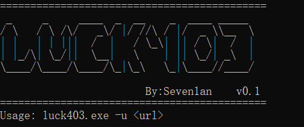
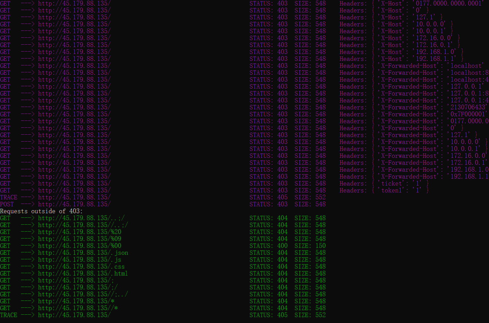

# Luck403

403bypass工具-Luck403，就和它的名字一样，希望可以在遇到 403 时绝处逢生，幸运点满，找到新的可能性。

## 声明

**本项目所有内容仅作为安全研究和授权测试使用, 相关人员对因误用和滥用该项目造成的一切损害概不负责**

使用：

​	Luck403.exe -u url

  

大概需要两分钟左右，后续打算搭配代理池来加快速度，不然容易被封 而且目前还是比较慢的

fuzz参数还在搜集和完善

扫描出的结果，会再次把非403的请求单独输出

项目地址：https://github.com/Seven1an/Luck403
